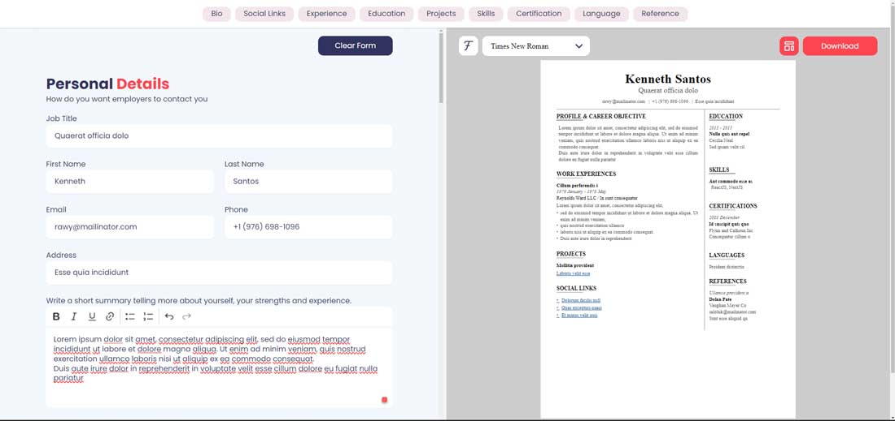

# Resume Generator App

## Project URL

[Resume Generator App](https://instaresume.vercel.app)

## Overview

The Resume Generator App is a web application built using Next.js (v14 app router), TypeScript, Redux, Tailwind CSS, and Email.js. It allows users to effortlessly generate professional resumes within minutes. With various templates and font options available, users can customize their resumes to suit their preferences and needs. This project is designed to simplify the resume creation process, providing a user-friendly interface and seamless experience.

## Project Features

- **Easy Resume Generation:** Create professional resumes quickly and easily.
- **Multiple Templates:** Choose from a variety of templates to customize your resume layout.
- **Font Options:** Select different fonts to personalize your resume's appearance.
- **Responsive Design:** The app is designed to work seamlessly across various devices and screen sizes.
- **User-friendly Interface:** Intuitive UI makes it simple for users to navigate and use the app effectively.

## How to Setup Locally

To set up the project locally, follow these steps:
note: node version should be >= 18.17

1. Clone the repository: `git clone https://github.com/ManojThulung/Insta-resume.git`
2. Navigate to the project directory: `cd insta-resume`
3. Install dependencies: `npm install`
4. Start the development server: `npm run dev`
5. Open your web browser and go to `http://localhost:3000` to access the app.

## Contributing & Feedback

🚀 **Active Development:** Project's evolving! Share ideas for improvements.
🛠 **New Features:** Got a great idea? Let's hear it!
🔄 **Pull Requests:** Contributions welcome! Bug fixes, features - all appreciated.
💬 **Feedback:** Your input matters! Report issues, suggest improvements.

Let's make this project awesome together! 🌟
